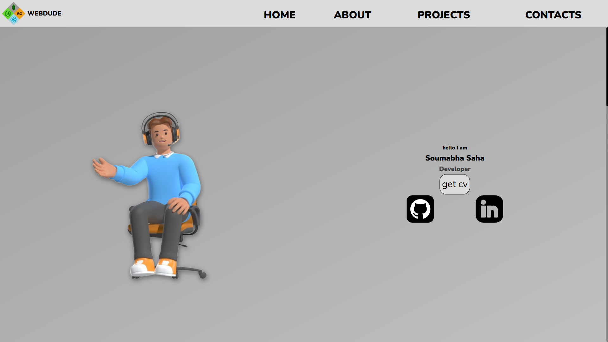

<h1 align="center">
  
</h1>

 
  Visitor count 
  

<h3 align="center">A passionate frontend developer from India</h3>

  

- 🌱 I'm currently learning _MERN stack_

- 📝 I often write articles on [https://hashnode.com/@soumabhasaha15](https://hashnode.com/@soumabhasaha15)

- 📄 Know about my experiences [CV Gdrive link](https://drive.google.com/file/d/1T7xJ_KN1l6lJIkANvYlqBa2cgkgPB1fo/view)

- 💬 Ask me about _Web Development, Competitive Programming, GCloud_

- 📫 How to reach me 

- ⚡ Fun fact _I'm also a Gamer_ 🎮 & always like to be a _dreamer🌙_

- 👨‍💻 All of my projects are available at my

  

## 💫 Github Stats

  

  

  

- 💬 Ask me about **C,C++,JS**
<h3 align="left">🌐 Connect with me:</h3>

<h3 align="left">Languages and Tools:</h3>

                  

&nbsp;

